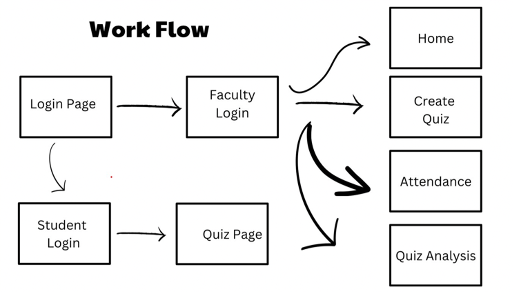
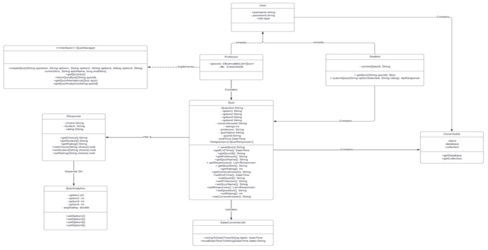
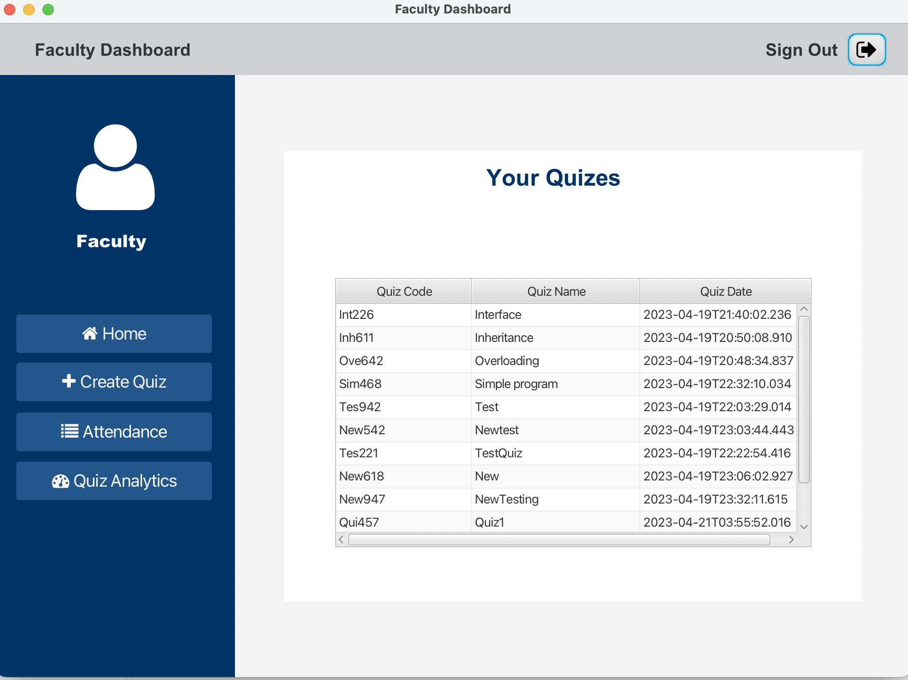
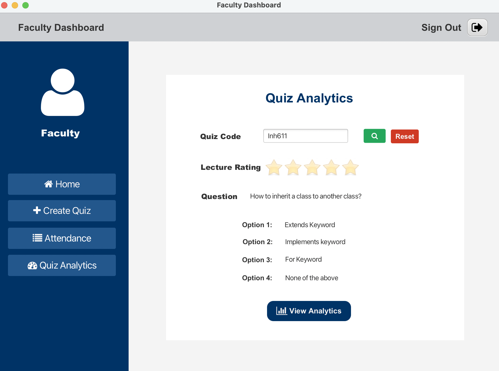
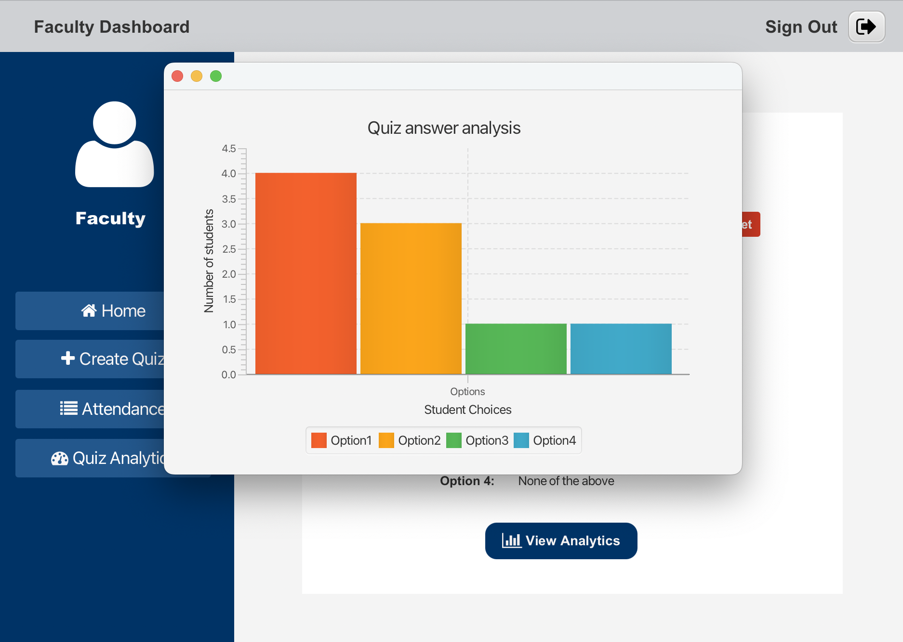

# Quizly

## Usage
- Download the repository and the associated jar dependencies.
- Add javafx to the startup script
- Host a Mongo database ```Quizly``` and update the ConnetToDB.java file

## Problem Statement
Quizly streamlines attendance tracking, feedback collection, and quiz management for faculty members, addressing the inefficiencies and inaccuracies of traditional methods. Our centralized and user-friendly platform enables faculty members to publish pop quizzes with unique IDs and time limits, view student responses, and gain valuable insights into their students' understanding of the lecture material.
Our software also simplifies attendance tracking, allowing students to enter the unique quiz ID to mark their attendance. Advanced analytics tools will be incorporated into the software to enable faculty members to generate insights into attendance records and feedback, helping them identify areas of improvement and enhance their teaching effectiveness.
Our goal is to empower faculty members by saving time, reducing errors, and enhancing teaching outcomes. With our software solution, faculty members can focus on teaching and interacting with their students rather than spending hours on administrative tasks.

## System Design
Quizly follows the Model-View-Controller pattern. The MVC pattern is a design pattern commonly used in Java projects to separate the application's user interface, data, and control logic into distinct modules.

The Model represents the data and the business logic of the application. It contains classes that interact with the database, perform calculations, and handle data storage and retrieval.

The View is responsible for the presentation of data to the user. It includes classes that generate the user interface, Fxml pages and graphical components.

The Controller acts as an intermediary between the View and the Model. It handles user input, updates the Model, and sends updated data to the View for display.




### Class Diagram



## External Libraries
```mongodb-driver-core-4.3.1``` and ```mongodb-driver-sync-4.3.1``` for integrating the application with the mongodb database. 
```bson-4.4.1``` for converting java classes to bson objects and vice versa. 
```fontawesomefx-8.2``` for styled components.
```controlsfx-11.1.2``` for UI controls. 

## Screenshots

### Login Page


### Faculty Dashboards




